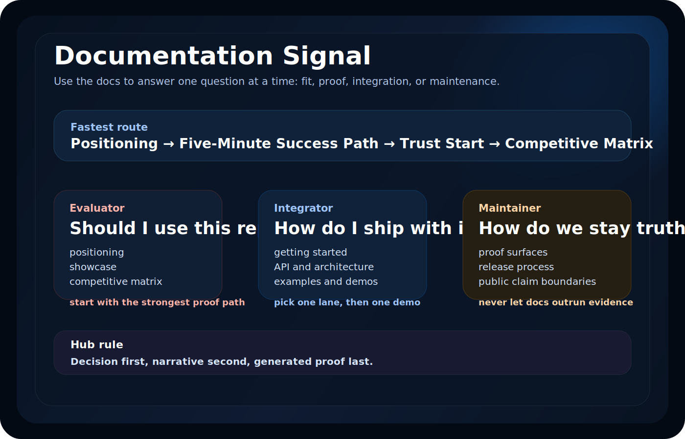

# SwiftIntelligence Documentation Hub

This hub is organized by intent, not by maintainer file dump.

  

## Start here in 30 seconds

| If your question is... | Start here | Why |
| --- | --- | --- |
| should I evaluate this repo at all? | [Positioning](Positioning.md) | category fit, win/loss boundaries, who should use it |
| what is the strongest proof path? | [Five-Minute Success Path](Getting-Started.md#five-minute-success-path) | fastest visible value with the flagship demo |
| can I trust the public claims? | [Trust Start](Trust-Start.md) | readiness, release posture, proof envelope, immutable evidence |
| is this better than the obvious alternatives? | [Competitive Matrix](Comparisons/Competitive-Matrix.md) | direct rival matrix and decision flow |

## Decision cards

| Persona | First move | Outcome |
| --- | --- | --- |
| Evaluator | [Positioning](Positioning.md) | decide whether the repo category fits at all |
| Integrator | [Getting Started](Getting-Started.md) | install and choose the right module lane |
| Maintainer | [Trust Start](Trust-Start.md) | stay inside the proof and release envelope |

## 1. I am evaluating the repo

- [Five-Minute Success Path](Getting-Started.md#five-minute-success-path)
- [Positioning](Positioning.md)
- [Competitive Matrix](Comparisons/Competitive-Matrix.md)
- [Showcase](Showcase.md)
- [Examples Hub](../Examples/README.md)

## 2. I need the strongest product path

- [Examples Hub](../Examples/README.md)
- [IntelligentCamera demo guide](../Examples/DemoApps/IntelligentCamera/README.md)
- [SmartTranslator demo guide](../Examples/DemoApps/SmartTranslator/README.md)
- [VoiceAssistant demo guide](../Examples/DemoApps/VoiceAssistant/README.md)
- [Flagship demo pack](Generated/Flagship-Demo-Pack.md)
- [Flagship media status](Generated/Flagship-Media-Status.md)

Use [Examples Hub](../Examples/README.md) as the canonical demo chooser. This section exists only to expose the maintained proof path and media surfaces.

## 3. I want trust, proof, and release reality

- [Trust Start](Trust-Start.md)
- [Public Proof Status](Generated/Public-Proof-Status.md)
- [Latest Release Proof](Generated/Latest-Release-Proof.md)
- [Benchmark Readiness](Generated/Benchmark-Readiness.md)

Use `Trust Start` when you need the human routing page.
Use the generated pages when exact claim wording, blockers, or release evidence details matter.

## 4. I want module-level comparisons

- [Comparisons hub](Comparisons/README.md)
- [NLP vs Apple NaturalLanguage](Comparisons/NLP-vs-NaturalLanguage.md)
- [Vision vs Apple Vision](Comparisons/Vision-vs-AppleVision.md)
- [Speech vs Apple Speech](Comparisons/Speech-vs-AppleSpeech.md)
- [Privacy vs CryptoKit + Security](Comparisons/Privacy-vs-CryptoKit-Security.md)

## 5. I am integrating the package

- [Getting Started](Getting-Started.md)
- [API Overview](API.md)
- [Architecture](Architecture.md)
- [Performance Guide](Performance.md)
- [API Reference](API-Reference.md)

## 6. I am contributing or maintaining

- [Contributing](../CONTRIBUTING.md)
- [Security Policy](../SECURITY.md)
- [Support Guide](../SUPPORT.md)
- [GitHub Distribution](GitHub-Distribution.md)
- [GitHub Copilot Instructions](../.github/copilot-instructions.md)

## 7. Generated proof surfaces

Use these when you need machine-generated truth, not narrative pages.

| Need | Start here |
| --- | --- |
| current proof envelope | [Proof Snapshot](Generated/Proof-Snapshot.md) |
| benchmark trend and methodology | [Benchmark History](Generated/Benchmark-History.md) |
| release-evidence timeline | [Release Proof Timeline](Generated/Release-Proof-Timeline.md) |
| device capture and handoff flow | [Device Evidence Plan](Generated/Device-Evidence-Plan.md) |
| provenance and archive truth | [Evidence Provenance](Generated/Evidence-Provenance.md) |

## Documentation rules

- Public examples must match the active package graph.
- Competitive pages must compare against primary sources and direct alternatives, not hype strawmen.
- Public performance language must stay inside the current proof envelope.
- Public install snippets must match the latest numbered release in `CHANGELOG.md`.
- The docs hub should send evaluators to outcomes first, then to maintainer detail.

This page should stay short, decision-first, and hostile to link sprawl.
