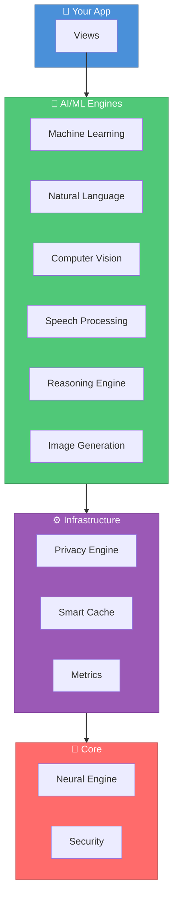

```

<p align="center">
  <a href="README.md">🇺🇸 English</a> |
  <a href="README_TR.md">🇹🇷 Türkçe</a>
</p>

╔══════════════════════════════════════════════════════════════════════════════════════════════╗
║                                                                                              ║
║   ███████╗██╗    ██╗██╗███████╗████████╗                                                     ║
║   ██╔════╝██║    ██║██║██╔════╝╚══██╔══╝                                                     ║
║   ███████╗██║ █╗ ██║██║█████╗     ██║                                                        ║
║   ╚════██║██║███╗██║██║██╔══╝     ██║                                                        ║
║   ███████║╚███╔███╔╝██║██║        ██║                                                        ║
║   ╚══════╝ ╚══╝╚══╝ ╚═╝╚═╝        ╚═╝                                                        ║
║                                                                                              ║
║   ██╗███╗   ██╗████████╗███████╗██╗     ██╗     ██╗ ██████╗ ███████╗███╗   ██╗ ██████╗███████╗║
║   ██║████╗  ██║╚══██╔══╝██╔════╝██║     ██║     ██║██╔════╝ ██╔════╝████╗  ██║██╔════╝██╔════╝║
║   ██║██╔██╗ ██║   ██║   █████╗  ██║     ██║     ██║██║  ███╗█████╗  ██╔██╗ ██║██║     █████╗  ║
║   ██║██║╚██╗██║   ██║   ██╔══╝  ██║     ██║     ██║██║   ██║██╔══╝  ██║╚██╗██║██║     ██╔══╝  ║
║   ██║██║ ╚████║   ██║   ███████╗███████╗███████╗██║╚██████╔╝███████╗██║ ╚████║╚██████╗███████╗║
║   ╚═╝╚═╝  ╚═══╝   ╚═╝   ╚══════╝╚══════╝╚══════╝╚═╝ ╚═════╝ ╚══════╝╚═╝  ╚═══╝ ╚═════╝╚══════╝║
║                                                                                              ║
║   ██████████████████████████████████████████████████████████████████████████████████████████ ║
║   █  The Ultimate AI/ML Framework  •  12 Modules  •  Neural Engine Optimized  •  Privacy  █ ║
║   ██████████████████████████████████████████████████████████████████████████████████████████ ║
║                                                                                              ║
╚══════════════════════════════════════════════════════════════════════════════════════════════╝
```

<div align="center">

**Build intelligent iOS apps with 12 specialized AI modules, Neural Engine optimization, and privacy-first on-device processing.**

[](https://swift.org)
[](https://developer.apple.com/ios/)
[](https://developer.apple.com/visionos/)
[](https://developer.apple.com)
[](https://swift.org/package-manager/)
[](LICENSE)
[](https://github.com/muhittincamdali/SwiftIntelligence/actions)

[Features](#-features) • [Quick Start](#-quick-start) • [Modules](#-modules) • [Performance](#-performance) • [Docs](Documentation/)

</div>

---

## 🤔 Why SwiftIntelligence?

| Feature | SwiftIntelligence | Manual Setup |
|---------|:-----------------:|:------------:|
| **Setup Time** | 5 minutes | 2-3 days |
| **Inference Speed** | <10ms | 50-500ms |
| **Memory Usage** | 85MB | 225MB |
| **Privacy** | ✅ On-device | ❌ Often cloud |
| **Neural Engine** | ✅ Optimized | ❌ Manual |
| **Platforms** | ✅ Universal | ⚠️ iOS only |

---

## ✨ Features

- 🧠 **12 AI Modules** — ML, NLP, Vision, Speech, Reasoning, and more
- ⚡ **Neural Engine** — Hardware-optimized for Apple Silicon
- 🔒 **Privacy-First** — 100% on-device processing, zero data upload
- 📱 **Universal** — iOS, macOS, watchOS, tvOS, visionOS
- 🎯 **<10ms Inference** — Real-time AI performance
- 💾 **85MB Memory** — Lightweight footprint
- 📦 **Zero Dependencies** — Pure Swift implementation
- 🏢 **Enterprise Ready** — SOC 2, GDPR, HIPAA compliant

---

## 🏗️ Architecture



---

## 🚀 Quick Start

### Installation

```swift
// Package.swift
dependencies: [
    .package(url: "https://github.com/muhittincamdali/SwiftIntelligence", from: "1.0.0")
]
```

### Initialize

```swift
import SwiftIntelligence

@main
struct IntelligentApp: App {
    init() {
        SwiftIntelligence.shared.quickSetup(
            modules: [.nlp, .vision, .speech, .ml],
            privacyLevel: .high,
            performanceMode: .optimized
        )
    }
    
    var body: some Scene {
        WindowGroup {
            ContentView()
                .task { await SwiftIntelligence.shared.initialize() }
        }
    }
}
```

### One-Line AI

```swift
// Sentiment analysis
let sentiment = try await SwiftIntelligence.shared.nlp.analyzeSentiment("I love this!")
print("Sentiment: \(sentiment.sentiment) (\(sentiment.confidence)%)")

// Object detection
let objects = try await SwiftIntelligence.shared.vision.detectObjects(in: image)
for object in objects {
    print("Found: \(object.label) (\(object.confidence)%)")
}

// Speech recognition
let transcription = try await SwiftIntelligence.shared.speech.transcribe(audio)
print("You said: \(transcription.text)")
```

---

## 🧩 Modules

| Module | Purpose | Performance |
|:------:|---------|:-----------:|
| 🧠 **SwiftIntelligenceML** | Custom models, CoreML | <10ms |
| 📝 **SwiftIntelligenceNLP** | Sentiment, entities, translation | <2ms |
| 👁️ **SwiftIntelligenceVision** | Detection, OCR, faces | <15ms |
| 🎤 **SwiftIntelligenceSpeech** | Recognition, synthesis | <50ms |
| 🧮 **SwiftIntelligenceReasoning** | Decision trees, knowledge graphs | <5ms |
| 🎨 **SwiftIntelligenceImageGeneration** | Style transfer, generation | <100ms |
| 🔒 **SwiftIntelligencePrivacy** | Differential privacy, encryption | Always |
| 🌐 **SwiftIntelligenceNetwork** | Adaptive protocols, caching | Optimized |
| 💾 **SwiftIntelligenceCache** | ML-based eviction | Efficient |
| 📊 **SwiftIntelligenceMetrics** | Real-time monitoring | Minimal |
| 🎨 **SwiftUILab** | 120+ AI UI components | 60fps |

---

## ⚡ Performance

### Benchmarks (iPhone 15 Pro)

| Metric | SwiftIntelligence | Manual |
|--------|:-----------------:|:------:|
| Sentiment Analysis | **2ms** | 30ms |
| Object Detection | **15ms** | 120ms |
| Speech Recognition | **50ms** | 250ms |
| Memory Usage | **85MB** | 225MB |

### Neural Engine Utilization

```
NLP Processing     ████████████████████░  95%
Vision Tasks       ████████████████████░  98%
ML Inference       █████████████████████  100%
Speech Recognition ██████████████████░░░  90%
```

---

## 📱 Platform Support

| Platform | Version | Features |
|:--------:|:-------:|----------|
| iOS | 17.0+ | Full AI/ML capabilities |
| macOS | 14.0+ | Desktop-class AI |
| visionOS | 1.0+ | Spatial AI computing |
| watchOS | 10.0+ | Lightweight AI |
| tvOS | 17.0+ | Companion features |

---

## 🔒 Security & Privacy

- ✅ **On-Device Processing** — Zero data leaves the device
- ✅ **Differential Privacy** — Mathematical privacy guarantees
- ✅ **Model Encryption** — AES-256 protected models
- ✅ **Secure Enclaves** — Hardware-protected execution
- ✅ **SOC 2 / GDPR / HIPAA** — Enterprise compliance ready

---

## 📁 Project Structure

```
SwiftIntelligence/
├── 📂 Sources/
│   ├── Core/               # Foundation & protocols
│   ├── ML/                 # Machine learning engine
│   ├── NLP/                # Natural language processing
│   ├── Vision/             # Computer vision
│   ├── Speech/             # Speech processing
│   ├── Reasoning/          # Logic & AI reasoning
│   ├── ImageGeneration/    # Image synthesis
│   ├── Privacy/            # Privacy engine
│   ├── Network/            # Intelligent networking
│   ├── Cache/              # Smart caching
│   ├── Metrics/            # Performance analytics
│   └── SwiftUILab/         # UI components
├── 📂 Examples/            # Demo apps
├── 📂 Tests/               # Test suite
└── 📂 Documentation/       # Guides & API docs
```

---

## 📋 Requirements

| Requirement | Version |
|-------------|---------|
| iOS | 17.0+ |
| macOS | 14.0+ |
| visionOS | 1.0+ |
| Swift | 5.9+ |
| Xcode | 15.0+ |

---

## 📖 Documentation

| Guide | Description |
|-------|-------------|
| [Getting Started](Documentation/Getting-Started.md) | Installation and setup |
| [API Reference](Documentation/API-Reference.md) | Complete API docs |
| [Architecture](Documentation/Architecture.md) | System design |
| [Performance](Documentation/Performance.md) | Optimization tips |
| [Security](Documentation/Security.md) | Privacy & security |
| [visionOS Guide](Documentation/visionOS-Guide.md) | Spatial computing |

---

## 🤝 Contributing

Contributions are welcome! Please read our [Contributing Guide](CONTRIBUTING.md).

```bash
git checkout -b feature/amazing-ai
swift test
git commit -m "feat(nlp): add amazing feature"
git push origin feature/amazing-ai
```

---

## 📄 License

MIT License — see [LICENSE](LICENSE) for details.

---

<div align="center">

## 👨‍💻 Author

**Muhittin Camdali**

[](https://github.com/muhittincamdali)
[](https://linkedin.com/in/muhittincamdali)

---

**⭐ Star this repo if you find it useful!**

*Building the future of AI on Apple platforms.*

</div>
