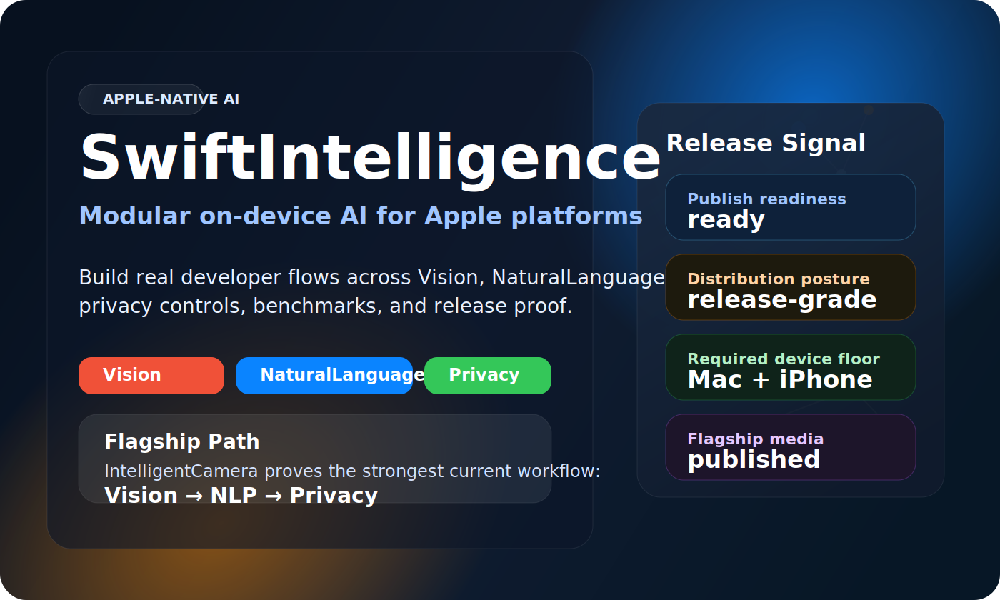
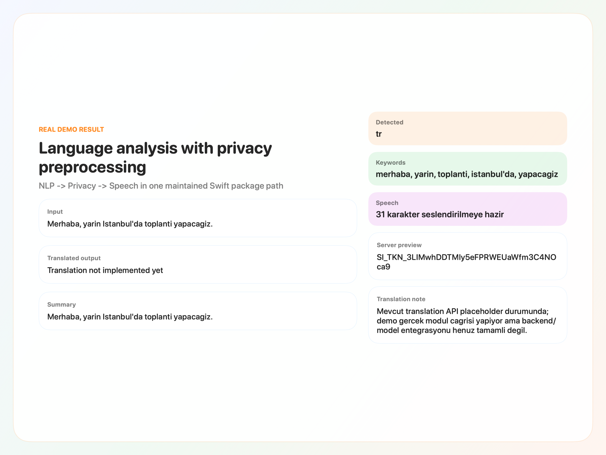
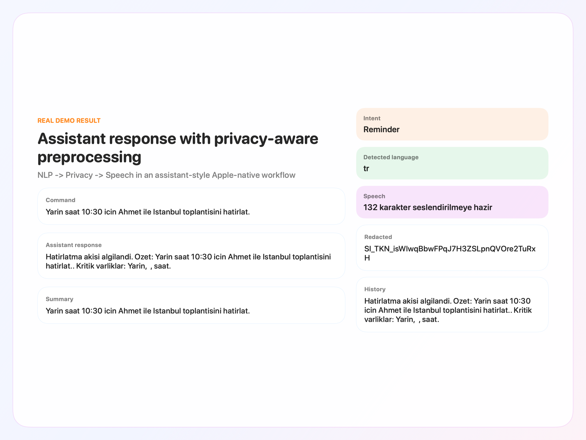
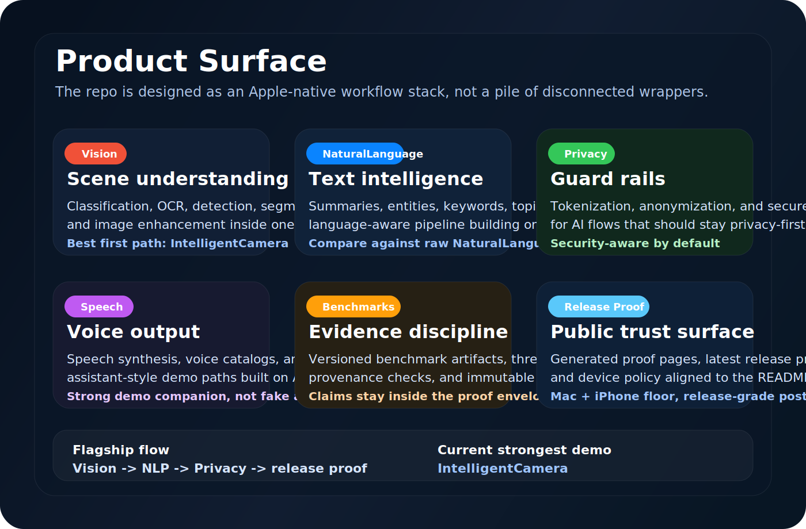
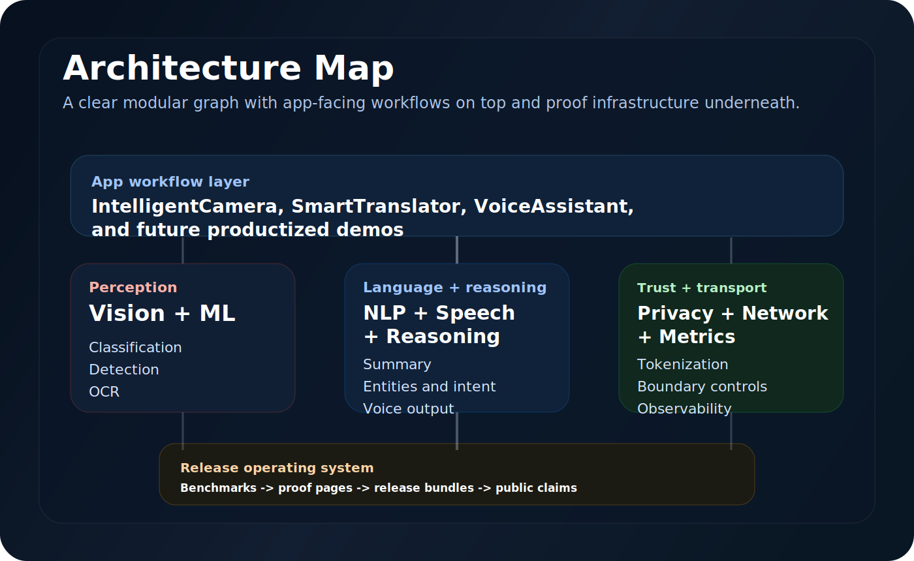
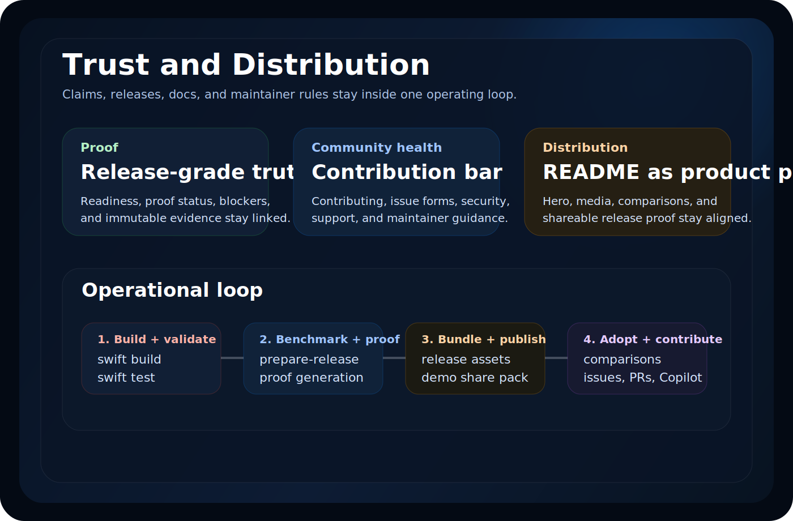

<div align="center">
  
</div>

<p align="center">
  <strong>SwiftIntelligence</strong> is an Apple-native AI workflow stack for teams that need
  <code>Vision</code>, <code>NaturalLanguage</code>, <code>Speech</code>, privacy controls, benchmarks, and release proof to ship as one product path.
</p>

<p align="center">
  Use it when multiple Apple AI capabilities must ship together with proof discipline.
  Skip it when raw Apple APIs or a narrower package already close the product path cleanly.
</p>

<p align="center">
  <a href="Documentation/Getting-Started.md#five-minute-success-path"><strong>Start Here</strong></a> •
  <a href="Examples/README.md"><strong>Examples Hub</strong></a> •
  <a href="Documentation/Generated/Public-Proof-Status.md"><strong>Release Proof</strong></a>
</p>

<p align="center">
  Need rival-fit first? See <a href="Documentation/Comparisons/Competitive-Matrix.md">Competitive Matrix</a>.
  Need the human trust router? See <a href="Documentation/Trust-Start.md">Trust Start</a>.
  Need the repo story in another language? See <a href="Documentation/README-Languages.md">README Languages</a>.
</p>


## First Decision

| Need | Best next move |
| --- | --- |
| one maintained Apple workflow that spans modules and release proof | [Five-Minute Success Path](Documentation/Getting-Started.md#five-minute-success-path) |
| exact trust, readiness, and release-claim boundaries | [Trust Start](Documentation/Trust-Start.md) |
| named-rival fit before adoption | [Competitive Matrix](Documentation/Comparisons/Competitive-Matrix.md) |
| only one low-level framework call or a specialist package | stay on raw Apple APIs or choose the narrower package first |

Use [Public Proof Status](Documentation/Generated/Public-Proof-Status.md) only when exact claim wording matters.


## Demo Gallery

<p align="center">
  <a href="Examples/DemoApps/IntelligentCamera/README.md">
    
  </a>
</p>

`IntelligentCamera` is the fastest honest proof of value in this repository.
It closes the strongest maintained path: `Vision -> NLP -> Privacy`.

Flagship media:
- [Guide](Examples/DemoApps/IntelligentCamera/README.md)
- [Recording](Documentation/Assets/Flagship-Demo/intelligent-camera-run.mp4)
- [Caption](Documentation/Assets/Flagship-Demo/caption.txt)
- [Media Policy](Documentation/Assets/Flagship-Demo/README.md)

```bash
bash Scripts/validate-flagship-demo.sh
```

<table>
  <tr>
    <td width="50%" valign="top">
      <a href="Examples/DemoApps/SmartTranslator/README.md">
        
      </a>
      <p><strong>SmartTranslator</strong><br /><code>NLP -&gt; Privacy -&gt; Speech</code></p>
      <p>Best secondary path for text analysis, tokenized preview, and translated output.</p>
      <p>
        <a href="Examples/DemoApps/SmartTranslator/README.md">Guide</a> •
        <a href="Documentation/Assets/SmartTranslator-Demo/smarttranslator-run.mp4">Recording</a> •
        <a href="Documentation/Assets/SmartTranslator-Demo/README.md">Media Policy</a>
      </p>
    </td>
    <td width="50%" valign="top">
      <a href="Examples/DemoApps/VoiceAssistant/README.md">
        
      </a>
      <p><strong>VoiceAssistant</strong><br /><code>NLP -&gt; Privacy -&gt; Speech</code></p>
      <p>Best secondary path for assistant-style intent handling and privacy-aware response output.</p>
      <p>
        <a href="Examples/DemoApps/VoiceAssistant/README.md">Guide</a> •
        <a href="Documentation/Assets/VoiceAssistant-Demo/voiceassistant-run.mp4">Recording</a> •
        <a href="Documentation/Assets/VoiceAssistant-Demo/README.md">Media Policy</a>
      </p>
    </td>
  </tr>
</table>

`SmartTranslator` and `VoiceAssistant` carry real media and maintained guides.
They are not flagship proof surfaces, but they are no longer source-only demos.

Use [Examples Hub](Examples/README.md) when you need the canonical demo chooser.


## Product Surface

<p align="center">
  
</p>

| Product lane | Start with demo | Compare first | Why this lane matters |
| --- | --- | --- | --- |
| Vision | [IntelligentCamera](Examples/DemoApps/IntelligentCamera/README.md) | [Vision vs Apple Vision](Documentation/Comparisons/Vision-vs-AppleVision.md) | strongest maintained product path and flagship evaluator route |
| NaturalLanguage | [SmartTranslator](Examples/DemoApps/SmartTranslator/README.md) | [NLP vs NaturalLanguage](Documentation/Comparisons/NLP-vs-NaturalLanguage.md) | clearest text-first path for summaries, entities, and transformed output |
| Speech | [VoiceAssistant](Examples/DemoApps/VoiceAssistant/README.md) | [Speech vs Apple Speech](Documentation/Comparisons/Speech-vs-AppleSpeech.md) | assistant-style response flows without pretending to be a speech-recognition leader |
| Privacy | [IntelligentCamera](Examples/DemoApps/IntelligentCamera/README.md) | [Privacy vs CryptoKit + Security](Documentation/Comparisons/Privacy-vs-CryptoKit-Security.md) | makes tokenization and safer handling visible in app-facing workflows |
| Benchmarks | [Examples Hub](Examples/README.md) | [Benchmark Baselines](Documentation/Benchmark-Baselines.md) | keeps claims inside thresholds, manifests, and immutable bundles |
| Release Proof | [Trust Start](Documentation/Trust-Start.md) | [Latest Release Proof](Documentation/Generated/Latest-Release-Proof.md) | closes trust and release questions with generated evidence |

## Competitive Reality

SwiftIntelligence does **not** win by pretending to be `MLX`, `coremltools`, or a generic cross-platform inference runtime.

It wins only if it is clearly better at:

- Apple-native workflow composition
- proof-backed release discipline
- multi-module adoption guidance
- faster first success for real app teams

Current top comparison set:

- [SwiftIntelligence vs Top Rivals](Documentation/Comparisons/Competitive-Matrix.md)
- [NLP vs Apple NaturalLanguage](Documentation/Comparisons/NLP-vs-NaturalLanguage.md)
- [Vision vs Apple Vision](Documentation/Comparisons/Vision-vs-AppleVision.md)
- [Speech vs Apple Speech](Documentation/Comparisons/Speech-vs-AppleSpeech.md)
- [Privacy vs CryptoKit + Security](Documentation/Comparisons/Privacy-vs-CryptoKit-Security.md)


## Architecture Signal

<p align="center">
  
</p>

| Layer | Maintained surface |
| --- | --- |
| Flagship workflows | `IntelligentCamera`, `SmartTranslator`, `VoiceAssistant` |
| Perception | `SwiftIntelligenceVision`, `SwiftIntelligenceML` |
| Language | `SwiftIntelligenceNLP`, `SwiftIntelligenceSpeech`, `SwiftIntelligenceReasoning` |
| Trust and transport | `SwiftIntelligencePrivacy`, `SwiftIntelligenceNetwork`, `SwiftIntelligenceMetrics`, `SwiftIntelligenceCache` |
| Release operating system | `SwiftIntelligenceBenchmarks`, generated proof pages, release bundles, media pack |

## Trust Surface

<p align="center">
  
</p>

| Signal | Current truth |
| --- | --- |
| Publish readiness | `ready` |
| Distribution posture | `release-grade` |
| Required release device floor | `Mac + iPhone` |
| Flagship media | `published` |
| Secondary demo media | `SmartTranslator, VoiceAssistant published` |
| Canonical trust start | [Trust Start](Documentation/Trust-Start.md) |
| Latest immutable proof | [Latest Release Proof](Documentation/Generated/Latest-Release-Proof.md) |


## Docs Map

| You are... | Start here |
| --- | --- |
| Evaluating the repo | [Documentation Hub](Documentation/README.md) |
| Trying the strongest path | [Getting Started](Documentation/Getting-Started.md) |
| Comparing options | [Competitive Matrix](Documentation/Comparisons/Competitive-Matrix.md) |
| Reviewing trust and release proof | [Trust Start](Documentation/Trust-Start.md) |
| Looking for product examples | [Examples](Examples/README.md) |
| Contributing or maintaining | [Contributing](CONTRIBUTING.md) |

## Install The Strongest Path

```swift
dependencies: [
    .package(url: "https://github.com/muhittincamdali/SwiftIntelligence.git", from: "1.2.1")
],
targets: [
    .target(
        name: "MyApp",
        dependencies: [
            .product(name: "SwiftIntelligenceCore", package: "SwiftIntelligence"),
            .product(name: "SwiftIntelligenceVision", package: "SwiftIntelligence"),
            .product(name: "SwiftIntelligenceNLP", package: "SwiftIntelligence"),
            .product(name: "SwiftIntelligencePrivacy", package: "SwiftIntelligence")
        ]
    )
]
```

Validate the same public path the repo claims:

```bash
swift build
bash Scripts/validate-flagship-demo.sh
bash Scripts/validate-examples.sh
swift test
```

## Module Surface

<details open>
<summary><strong>Core modules and what they do</strong></summary>

| Module | Role |
| --- | --- |
| `SwiftIntelligenceCore` | shared configuration, logging, runtime utilities |
| `SwiftIntelligenceML` | on-device training, prediction, evaluation, cache management |
| `SwiftIntelligenceNLP` | sentiment, entities, keywords, summaries, topics |
| `SwiftIntelligenceVision` | classification, detection, OCR, segmentation, enhancement |
| `SwiftIntelligenceSpeech` | speech-related types, synthesis, voice catalogs |
| `SwiftIntelligencePrivacy` | tokenization, anonymization, secure storage, compliance helpers |
| `SwiftIntelligenceReasoning` | higher-level reasoning primitives |
| `SwiftIntelligenceNetwork` | network-layer helpers |
| `SwiftIntelligenceCache` | cache primitives |
| `SwiftIntelligenceMetrics` | metrics and observability support |
| `SwiftIntelligenceBenchmarks` | benchmark runners, artifacts, thresholds, baselines |

</details>

## Community and Maintenance Surface

| If you need to verify... | Start here | Why |
| --- | --- | --- |
| how contributions are judged | [Contributing](CONTRIBUTING.md) | the quality bar for code, proof, examples, and public claims |
| how vulnerabilities should be reported | [Security Policy](SECURITY.md) | private intake path and current security operations matrix |
| how to get help or route an issue | [Support](SUPPORT.md) | support channels, repro expectations, and maintainer gate set |
| how GitHub-facing metadata stays aligned | [GitHub Distribution](Documentation/GitHub-Distribution.md) | About box, topics, README story, and public proof routing |
| how releases are prepared and validated | [Release Process](Documentation/Release-Process.md) | release asset, proof, and publication discipline |
| how to support ongoing maintenance | [GitHub Sponsors](https://github.com/sponsors/muhittincamdali) | direct maintenance support linked from `.github/FUNDING.yml` |
| how collaboration stays safe | [Code of Conduct](CODE_OF_CONDUCT.md) | conduct expectations across public interactions |

## License

Released under the [MIT License](LICENSE).
